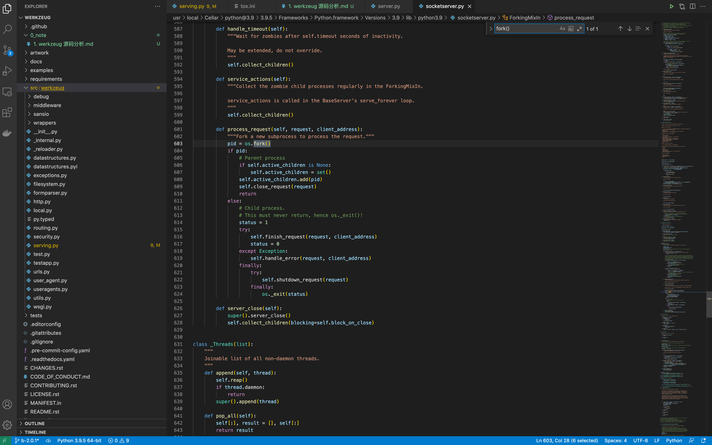

## 启动最简单的服务器
```
from werkzeug.wrappers import Request, Response

# 最简单的一个 app
def simple_app(environ, start_response):
    start_response('200 OK', [('Content-Type', 'text/plain')])
    return [b'Hello World!']

# 作为 wsgi 服务的传入对象。environ 中可以读取到 request。传进来一个函数 start_response。
def application(environ, start_response):
    request = Request(environ)
    text = 'Hello %s!' % request.args.get('name', 'World')
    response = Response(text, mimetype='text/plain')
    return response(environ, start_response)

if __name__ == '__main__':
    from werkzeug.serving import run_simple
    # run_simple('127.0.0.1', 5000, application, use_debugger=True, use_reloader=True)
    run_simple('127.0.0.1', 5000, simple_app, use_debugger=True, use_reloader=True, processes=1)
```

## 如何启动的端口服务
扩展的 socketserver 的功能。底层直接使用的 fork 的功能, 没有使用 mutipleprocess。
